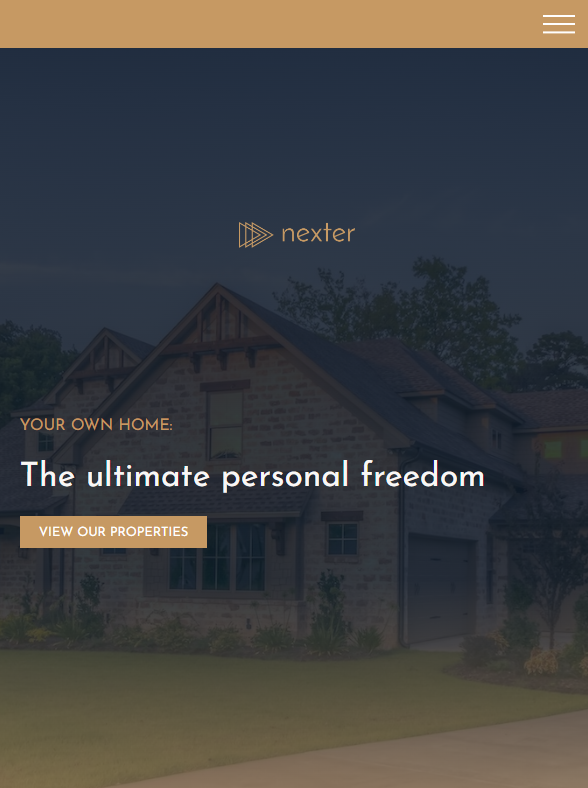

# Nexter

_**What is Nexter project ?** Nexter is single page website which is a fictional real estate company. You can visit by clicking link &rarr; [Nexter](https://nexter-gldn.netlify.app/)._

 

### What did I learn during developing this project ?

_In this process I learn how can I use Sass , CSS Grid and Flexbox also with minmax() function in CSS Grid I could make grid items align without using media queries. This is awesome shortcut for placing items easily and efforless._
 

> #
>
> - _what is fr unit,_
> - _create grid-templates with repeat() function,_
> - _difference between min-content and max-content,_
> - _positioning, spanning, naming, aligning, centering grid items,_
> - _difference between implicit and explicit grids,_
> - _with name of grid template items' placing grid items in grid container,_
> - _how to create a responsive component without media queries with minmax() function,_
> - _difference between extend and mixin in CSS,_
> - _create responsive layouts with auto-fit and auto-fill property,_
> - _create grid container with text and ::before, ::after pseudo-elements._
>
> #

 

 

 

 

 
 

 
 

 
 

 
 

 
 

